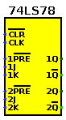
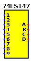
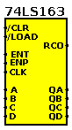
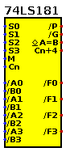

# 7400-logisim
Logisim library of 7400-series ICs

All circuits are intended for good 'ol Logisim 2.7.1.
Should also work with Logisim-ITA.
Don't know about Evolution which seems to constantly break older circuits, which is the reason I keep using the original version.
Despite some of its UI related bugs, 2.7.1 is a fixed target.
New circuits are added on a need-to-have basis (or when I'm bored).
Have fun!

| Part | Description | Symbol | Circuit | Notes |
| --- | --- | --- | --- | --- |
| 74LS01, 74LS03, 74LS09, 74LS26, 74LS38, 74LS39 | quad 2-input NAND gate, open-collector |  | [NAND2_OC.circ](circ/NAND_OC.circ) | |
| 74LS05, 74LS06 , 74LS16 | hex inverter, open-collector |  | [INV_OC.circ](circ/INV_OC.circ) | |
| 74LS07, 74LS17, 74LS35 | hex buffer, open-collector |  | [BUF_OC.circ](circ/BUF_OC.circ) | |
| 74LS12, 74LS15 | triple 3-input NAND gate, open-collector |  | [NAND3_OC.circ](circ/NAND3_OC.circ) | |
| 74LS22 | dual 4-input NAND gate, open-collector |  | [NAND4_OC.circ](circ/NAND4_OC.circ) | |
| 74LS33 | quad 2-input NOR gate, open-collector |  | [NOR2_OC.circ](circ/NOR2_OC.circ) | |
| 74LS41 | BCD to decimal decoder / Nixie tube driver, open-collector |  | [74LS41.circ](circ/74LS41.circ) | |
| 74LS42 | BCD to decimal decoder |  | [74LS42.circ](circ/74LS42.circ) | |
| 74LS46, 74LS47 | BCD to 7-segment decoder/driver, open-collector |  | [74LS46.circ](circ/74LS46.circ) | |
| 74LS48 | BCD to 7-segment decoder/driver, open-collector, internal pull-up |  | [74LS48.circ](circ/74LS48.circ) | |
| 74LS49 | BCD to 7-segment decoder/driver, open-collector |  | [74LS49.circ](circ/74LS49.circ) | |
| 74LS51 | 3-3-input AND-OR-Invert gate and 2-2-input AND-OR-Invert gate |  | [74LS51.circ](circ/74LS51.circ) | |
| 74LS67 | AND gated J-K master-slave flip-flop, asynchronous preset and clear |  | [74LS67.circ](circ/74LS67.circ) | |
| 74L68 | dual J-K flip-flop, asynchronous clear |  | [74LS68.circ](circ/74L68.circ) | |
| 74LS68 | dual 4-bit decade counters |  | [74LS68.circ](circ/74LS68.circ) | |
| 74LS69 | dual 4-bit binary counters |  | [74LS69.circ](circ/74LS69.circ) | |
| 74LS74 | dual D positive edge triggered flip-flop |  | [74LS74.circ](circ/74LS74.circ) | |
| 74LS75 | 4-bit bistable latch, complementary outputs |  | [74LS75.circ](circ/74LS75.circ) | |
| 74LS77 | 4-bit bistable latch |  | [74LS77.circ](circ/74LS77.circ) | |
| 74LS78 | dual negative edge triggered J-K flip-flop, preset, common clock and common clear |  | [74LS78.circ](circ/74LS78.circ) | |
| 74LS82 | 2-bit binary full adder |  | [74LS82.circ](circ/74LS82.circ) | |
| 74LS83 | 4-bit binary full adder |  | [74LS83.circ](circ/74LS83.circ) | |
| 74LS85 | 4-bit magnitude comparator |  | [74LS85.circ](circ/74LS85.circ) | |
| 74LS87 | 4-bit true/complement/zero/one element |  | [74LS87.circ](circ/74LS87.circ) | |
| 74LS90 | decade counter |  | [74LS90.circ](circ/74LS90.circ) | |
| 74LS91 | 8-bit shift register, serial in, serial out, gated input |  | [74LS91.circ](circ/74LS91.circ) | |
| 74LS92 | divide-by-12 counter |  | [74LS92.circ](circ/74LS92.circ) | |
| 74LS93 | 4-bit binary counter |  | [74LS93.circ](circ/74LS93.circ) | |
| 74LS94 | 4-bit shift register, dual asynchronous presets |  | [74LS94.circ](circ/74LS94.circ) | |
| 74LS95 | 4-bit shift register, parallel in, parallel out, serial input |  | [74LS95.circ](circ/74LS95.circ) | |
| 74LS96 | 5-bit parallel-in/parallel-out shift register, asynchronous preset |  | [74LS96.circ](circ/74LS96.circ) | |
| 74LS97 | synchronous 6-bit binary rate multiplier |  | [74LS97.circ](circ/74LS97.circ) | |
| 74LS98 | 4-bit data selector/storage register |  | [74LS98.circ](circ/74LS98.circ) | |
| 74LS99 | 4-bit bidirectional universal shift register |  | [74LS99.circ](circ/74LS99.circ) | |
| 74LS100 | dual 4-bit bistable latch |  | [74LS100.circ](circ/74LS100.circ) | |
| 74L116 | dual 4-bit latch, clear |  | [74L116.circ](circ/74L116.circ) | |
| 74LS137 | 3-to-8 line decoder/demultiplexer, address latch, inverting outputs |  | [74LS137.circ](circ/74LS137.circ) | |
| 74LS138 | 3-to-8 line decoder/demultiplexer, inverting outputs|  | [74LS138.circ](circ/74LS138.circ) | |
| 74LS139 | dual 2-to-4 line decoder/demultiplexer, inverting outputs |  | [74LS139.circ](circ/74LS139.circ) | |
| 74LS141 | BCD to decimal decoder/driver for cold-cathode indicator / Nixie tube | | [74LS141.circ](circ/74LS141.circ) | |
| 74LS142 | decade counter/latch/decoder/driver for Nixie tubes |  | [74LS142.circ](circ/74LS142.circ) | |
| 74LS143 | decade counter/latch/decoder/7-segment driver |  | [74LS143.circ](circ/74LS143.circ) | |
| 74LS144 | decade counter/latch/decoder/7-segment driver |  | [74LS144.circ](circ/74LS144.circ) | |
| 74LS145 | BCD to decimal decoder/driver |  | [74LS145.circ](circ/74LS145.circ) | |
| 74LS146 | 3-to-8 line decoder |  | [74LS146.circ](circ/74LS146.circ) | |
| 74LS147 | 10-line to 4-line priority encoder |  | [74LS147.circ](circ/74LS147.circ) | |
| 74LS148 | 8-line to 3-line priority encoder |  | [74LS148.circ](circ/74LS148.circ) | |
| 74LS149 | 8-line to 8-line priority encoder |  | [74LS149.circ](circ/74LS149.circ) | |
| 74LS150 | 16-line to 1-line data selector/multiplexer |  | [74LS150.circ](circ/74LS150.circ) | |
| 74LS151 | 8-line to 1-line data selector/multiplexer |  | [74LS151.circ](circ/74LS151.circ) | |
| 74LS152 | 8-line to 1-line data selector/multiplexer, inverting output |  | [74LS152.circ](circ/74LS152.circ) | |
| 74LS153 | dual 4-line to 1-line data selector/multiplexer, non-inverting outputs |  | [74LS153.circ](circ/74LS153.circ) | |
| 74LS154 | 4-to-16 line decoder/demultiplexer, inverting outputs |  | [74LS154.circ](circ/74LS154.circ) | |
| 74LS155 | dual 2-to-4 line decoder/demultiplexer, inverting outputs |  | [74LS155.circ](circ/74LS155.circ) | |
| 74LS156 | dual 2-to-4 line decoder/demultiplexer, inverting outputs, open-collector |  | [74LS156.circ](circ/74LS156.circ) | |
| 74LS157 | quad 2-line to 1-line data selector/multiplexer, non-inverting outputs |  | [74LS157.circ](circ/74LS157.circ) | |
| 74LS158 | quad 2-line to 1-line data selector/multiplexer, inverting outputs |  | [74LS158.circ](circ/74LS158.circ) | |
| 74LS159 | 4-to-16 line decoder/demultiplexer, open-collector |  | [74LS159.circ](circ/74LS159.circ) | |
| 74LS163 | synchronous presettable 4-bit binary counter, synchronous clear |  | [74LS163.circ](circ/74LS163.circ) | |
| 74LS164 | 8-bit serial-in parallel-out (SIPO) shift register, asynchronous clear |  | [74LS164.circ](circ/74LS164.circ) | |
| 74LS165 | 8-bit parallel-in serial-out (PISO) shift register, parallel load, complementary outputs |  | [74LS165.circ](circ/74LS165.circ) | |
| 74LS166 | parallel-load 8-bit shift register |  | [74LS166.circ](circ/74LS166.circ) | |
| 74LS167 | synchronous decade rate multiplier  |  | [74LS167.circ](circ/74LS167.circ) | |
| 74LS168 | synchronous presettable 4-bit up/down decade counter |  | [74LS168.circ](circ/74LS168.circ) | datasheet bug fixed |
| 74LS169 | synchronous presettable 4-bit up/down binary counter |  | [74LS169.circ](circ/74LS169.circ) | |
| 74LS175 | quad D edge-triggered flip-flop, complementary outputs and asynchronous clear |  | [74LS175.circ](circ/74LS175.circ) | |
| 74LS180 | 9-bit odd/even parity bit generator and checker |  | [74LS180.circ](circ/74LS180.circ) | |
| 74LS181 | 4-bit arithmetic logic unit and function generator |  | [74LS181.circ](circ/74LS181.circ) | |
| 74LS182 | lookahead carry generator |  | [74LS182.circ](circ/74LS182.circ) | |
| 74LS183 | dual carry-save full adder |  | [74LS183.circ](circ/74LS183.circ) | |
| 74LS189 | 64-bit RAM (16x4), 4 data inputs, 4 inverted data outputs |  | [74LS189.circ](circ/74LS189.circ) | |
| 74LS230 | dual 4-bit buffer/driver, one inverted, one non-inverted; negative enable |  | [74LS230.circ](circ/74LS230.circ) | |
| 74LS231 | dual 4-bit buffer/driver, both inverted; one positive and one negative enable |  | [74LS231.circ](circ/74LS231.circ) | |
| 74LS237 | 3-to-8 line decoder/demultiplexer, address latch, active high outputs |  | [74LS237.circ](circ/74LS237.circ) | |
| 74LS240 | octal buffer, inverting outputs, three-state |  | [74LS240.circ](circ/74LS240.circ) | |
| 74LS241 | octal buffer, non-inverting outputs, three-state |  | [74LS241.circ](circ/74LS241.circ) | |
| 74LS244 | octal buffer, non-inverting outputs, three-state |  | [74LS244.circ](circ/74LS244.circ) | |
| 74LS245 | octal bus transceiver, non-inverting outputs |  | [74LS245.circ](circ/74LS245.circ) | |
| 74LS390 | dual 4-bit decade counter, asynchronous clear |  | [74LS390.circ](circ/74LS390.circ) | |
| 74LS393 | dual 4-bit binary counter, asynchronous clear |  | [74LS393.circ](circ/74LS393.circ) | |
