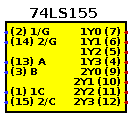
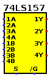
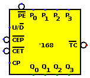
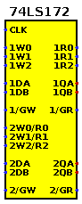
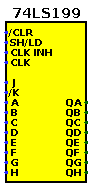
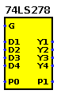

# 7400-logisim
Logisim library of 7400-series ICs

All circuits are intended for good 'ol Logisim 2.7.1.
Should also work with Logisim-ITA.
Don't know about Evolution which seems to constantly break older circuits, which is the reason I keep using the original version.
Despite some of its UI related bugs, 2.7.1 is a fixed target.
New circuits are added on a need-to-have basis (or when I'm bored).
Have fun!

* [1-99](#1-99)
* [100-199](#100-199)
* [200-299](#200-299)
* [300-399](#300-399)

## 1-99

| Part | Description | Symbol | Circuit | Notes |
| --- | --- | --- | --- | --- |
| 74LS01, 74LS03, 74LS09, 74LS26, 74LS38, 74LS39 | quad 2-input NAND gate, open-collector |  | [NAND2_OC.circ](circ/NAND_OC.circ) | |
| 74LS05, 74LS06 , 74LS16 | hex inverter, open-collector |  | [INV_OC.circ](circ/INV_OC.circ) | |
| 74LS07, 74LS17, 74LS35 | hex buffer, open-collector |  | [BUF_OC.circ](circ/BUF_OC.circ) | |
| 74LS12, 74LS15 | triple 3-input NAND gate, open-collector |  | [NAND3_OC.circ](circ/NAND3_OC.circ) | |
| 74LS22 | dual 4-input NAND gate, open-collector |  | [NAND4_OC.circ](circ/NAND4_OC.circ) | |
| 74LS33 | quad 2-input NOR gate, open-collector |  | [NOR2_OC.circ](circ/NOR2_OC.circ) | |
| 74LS41 | BCD to decimal decoder / Nixie tube driver, open-collector |  | [74LS41.circ](circ/74LS41.circ) | |
| 74LS42 | BCD to decimal decoder |  | [74LS42.circ](circ/74LS42.circ) | |
| 74LS46, 74LS47 | BCD to 7-segment decoder/driver, open-collector |  | [74LS46.circ](circ/74LS46.circ) | |
| 74LS48 | BCD to 7-segment decoder/driver, open-collector, internal pull-up |  | [74LS48.circ](circ/74LS48.circ) | |
| 74LS49 | BCD to 7-segment decoder/driver, open-collector |  | [74LS49.circ](circ/74LS49.circ) | |
| 74LS51 | 3-3-input AND-OR-Invert gate and 2-2-input AND-OR-Invert gate |  | [74LS51.circ](circ/74LS51.circ) | |
| 74LS67 | AND gated J-K master-slave flip-flop, asynchronous preset and clear |  | [74LS67.circ](circ/74LS67.circ) | |
| 74L68 | dual J-K flip-flop, asynchronous clear |  | [74LS68.circ](circ/74L68.circ) | |
| 74LS68 | dual 4-bit decade counters |  | [74LS68.circ](circ/74LS68.circ) | |
| 74LS69 | dual 4-bit binary counters |  | [74LS69.circ](circ/74LS69.circ) | |
| 74LS74 | dual D positive edge triggered flip-flop |  | [74LS74.circ](circ/74LS74.circ) | |
| 74LS75 | 4-bit bistable latch, complementary outputs |  | [74LS75.circ](circ/74LS75.circ) | |
| 74LS77 | 4-bit bistable latch |  | [74LS77.circ](circ/74LS77.circ) | |
| 74LS78 | dual negative edge triggered J-K flip-flop, preset, common clock and common clear |  | [74LS78.circ](circ/74LS78.circ) | |
| 74LS82 | 2-bit binary full adder |  | [74LS82.circ](circ/74LS82.circ) | |
| 74LS83 | 4-bit binary full adder |  | [74LS83.circ](circ/74LS83.circ) | |
| 74LS85 | 4-bit magnitude comparator |  | [74LS85.circ](circ/74LS85.circ) | |
| 74LS87 | 4-bit true/complement/zero/one element |  | [74LS87.circ](circ/74LS87.circ) | |
| 74LS90 | decade counter |  | [74LS90.circ](circ/74LS90.circ) | |
| 74LS91 | 8-bit shift register, serial in, serial out, gated input |  | [74LS91.circ](circ/74LS91.circ) | |
| 74LS92 | divide-by-12 counter |  | [74LS92.circ](circ/74LS92.circ) | |
| 74LS93 | 4-bit binary counter |  | [74LS93.circ](circ/74LS93.circ) | |
| 74LS94 | 4-bit shift register, dual asynchronous presets |  | [74LS94.circ](circ/74LS94.circ) | |
| 74LS95 | 4-bit shift register, parallel in, parallel out, serial input |  | [74LS95.circ](circ/74LS95.circ) | |
| 74LS96 | 5-bit parallel-in/parallel-out shift register, asynchronous preset |  | [74LS96.circ](circ/74LS96.circ) | |
| 74LS97 | synchronous 6-bit binary rate multiplier |  | [74LS97.circ](circ/74LS97.circ) | |
| 74LS98 | 4-bit data selector/storage register |  | [74LS98.circ](circ/74LS98.circ) | |
| 74LS99 | 4-bit bidirectional universal shift register |  | [74LS99.circ](circ/74LS99.circ) | |

## 100-199
[back to top](#7400-logisim)

| Part | Description | Symbol | Circuit | Notes |
| --- | --- | --- | --- | --- |
| 74LS100 | dual 4-bit bistable latch |  | [74LS100.circ](circ/74LS100.circ) | |
| 74L116 | dual 4-bit latch, clear |  | [74L116.circ](circ/74L116.circ) | |
| 74LS137 | 3-to-8 line decoder/demultiplexer, address latch, inverting outputs |  | [74LS137.circ](circ/74LS137.circ) | |
| 74LS138 | 3-to-8 line decoder/demultiplexer, inverting outputs|  | [74LS138.circ](circ/74LS138.circ) | |
| 74LS139 | dual 2-to-4 line decoder/demultiplexer, inverting outputs |  | [74LS139.circ](circ/74LS139.circ) | |
| 74LS141 | BCD to decimal decoder/driver for cold-cathode indicator / Nixie tube | | [74LS141.circ](circ/74LS141.circ) | |
| 74LS142 | decade counter/latch/decoder/driver for Nixie tubes |  | [74LS142.circ](circ/74LS142.circ) | |
| 74LS143 | decade counter/latch/decoder/7-segment driver |  | [74LS143.circ](circ/74LS143.circ) | |
| 74LS144 | decade counter/latch/decoder/7-segment driver |  | [74LS144.circ](circ/74LS144.circ) | |
| 74LS145 | BCD to decimal decoder/driver |  | [74LS145.circ](circ/74LS145.circ) | |
| 74LS146 | 3-to-8 line decoder |  | [74LS146.circ](circ/74LS146.circ) | |
| 74LS147 | 10-line to 4-line priority encoder |  | [74LS147.circ](circ/74LS147.circ) | |
| 74LS148 | 8-line to 3-line priority encoder |  | [74LS148.circ](circ/74LS148.circ) | |
| 74LS149 | 8-line to 8-line priority encoder |  | [74LS149.circ](circ/74LS149.circ) | |
| 74LS150 | 16-line to 1-line data selector/multiplexer |  | [74LS150.circ](circ/74LS150.circ) | |
| 74LS151 | 8-line to 1-line data selector/multiplexer |  | [74LS151.circ](circ/74LS151.circ) | |
| 74LS152 | 8-line to 1-line data selector/multiplexer, inverting output |  | [74LS152.circ](circ/74LS152.circ) | |
| 74LS153 | dual 4-line to 1-line data selector/multiplexer, non-inverting outputs |  | [74LS153.circ](circ/74LS153.circ) | |
| 74LS154 | 4-to-16 line decoder/demultiplexer, inverting outputs |  | [74LS154.circ](circ/74LS154.circ) | |
| 74LS155 | dual 2-to-4 line decoder/demultiplexer, inverting outputs |  | [74LS155.circ](circ/74LS155.circ) | |
| 74LS156 | dual 2-to-4 line decoder/demultiplexer, inverting outputs, open-collector |  | [74LS156.circ](circ/74LS156.circ) | |
| 74LS157 | quad 2-line to 1-line data selector/multiplexer, non-inverting outputs |  | [74LS157.circ](circ/74LS157.circ) | |
| 74LS158 | quad 2-line to 1-line data selector/multiplexer, inverting outputs |  | [74LS158.circ](circ/74LS158.circ) | |
| 74LS159 | 4-to-16 line decoder/demultiplexer, open-collector |  | [74LS159.circ](circ/74LS159.circ) | |
| 74LS163 | synchronous presettable 4-bit binary counter, synchronous clear |  | [74LS163.circ](circ/74LS163.circ) | |
| 74LS164 | 8-bit serial-in parallel-out (SIPO) shift register, asynchronous clear |  | [74LS164.circ](circ/74LS164.circ) | |
| 74LS165 | 8-bit parallel-in serial-out (PISO) shift register, parallel load, complementary outputs |  | [74LS165.circ](circ/74LS165.circ) | |
| 74LS166 | parallel-load 8-bit shift register |  | [74LS166.circ](circ/74LS166.circ) | |
| 74LS167 | synchronous decade rate multiplier  |  | [74LS167.circ](circ/74LS167.circ) | |
| 74LS168 | synchronous presettable 4-bit up/down decade counter |  | [74LS168.circ](circ/74LS168.circ) | datasheet bug fixed |
| 74LS169 | synchronous presettable 4-bit up/down binary counter |  | [74LS169.circ](circ/74LS169.circ) | |
| 74LS170 | 16-bit register file (4x4), open-collector |  | [74LS170.circ](circ/74LS170.circ) | |
| 74LS171 | quad D flip-flops, clear |  | [74LS171.circ](circ/74LS171.circ) | |
| 74LS172 | 16-bit multiple port register file (8x2) |  | [74LS172.circ](circ/74LS172.circ) | |
| 74LS173 | quad D flip-flop, asynchronous clear |  | [74LS173.circ](circ/74LS173.circ) | |
| 74LS174 | hex D flip-flop, common asynchronous clear |  | [74LS174.circ](circ/74LS174.circ) | |
| 74LS175 | quad D edge-triggered flip-flop, complementary outputs and asynchronous clear |  | [74LS175.circ](circ/74LS175.circ) | |
| 74LS176 | presettable decade (bi-quinary) counter/latch |  | [74LS176.circ](circ/74LS176.circ) | |
| 74LS177 | presettable binary counter/latch |  | [74LS177.circ](circ/74LS177.circ) | |
| 74LS180 | 9-bit odd/even parity bit generator and checker |  | [74LS180.circ](circ/74LS180.circ) | |
| 74LS181 | 4-bit arithmetic logic unit and function generator |  | [74LS181.circ](circ/74LS181.circ) | |
| 74LS182 | lookahead carry generator |  | [74LS182.circ](circ/74LS182.circ) | |
| 74LS183 | dual carry-save full adder |  | [74LS183.circ](circ/74LS183.circ) | |
| 74LS189 | 64-bit RAM (16x4), 4 data inputs, 4 inverted data outputs |  | [74LS189.circ](circ/74LS189.circ) | |
| 74LS190 | synchronous presettable up/down 4-bit decade counter |  | [74LS190.circ](circ/74LS190.circ) | |
| 74LS191 | synchronous presettable up/down 4-bit binary counter |  | [74LS191.circ](circ/74LS191.circ) | |
| 74LS192 | synchronous presettable up/down 4-bit decade counter, clear |  | [74LS192.circ](circ/74LS192.circ) | |
| 74LS193 | synchronous presettable up/down 4-bit binary counter, clear |  | [74LS193.circ](circ/74LS193.circ) | |
| 74LS194 | 4-bit bidirectional universal shift register |  | [74LS194.circ](circ/74LS194.circ) | |
| 74LS195 | 4-bit parallel-access shift register |  | [74LS195.circ](circ/74LS195.circ) | |
| 74LS196 | presettable 4-bit decade counter/latch |  | [74LS196.circ](circ/74LS196.circ) | |
| 74LS197 | presettable 4-bit binary counter/latch |  | [74LS197.circ](circ/74LS197.circ) | |
| 74LS198 | 8-bit bidirectional universal shift register |  | [74LS198.circ](circ/74LS198.circ) | |
| 74LS199 | 8-bit universal shift register, J-NotK serial inputs |  | [74LS199.circ](circ/74LS199.circ) | |

## 200-299
[back to top](#7400-logisim)

| Part | Description | Symbol | Circuit | Notes |
| --- | --- | --- | --- | --- |
| 74LS200 | 256-bit RAM (256x1), three-state |  | [74LS200.circ](circ/74LS200.circ) | |
| 74LS201 | 256-bit RAM (256x1), three-state |  | [74LS201.circ](circ/74LS201.circ) | |
| 74LS202 | 256-bit RAM (256x1), three-state |  | [74LS202.circ](circ/74LS202.circ) | |
| 74LS206 | 256-bit RAM (256x1), open-collector |  | [74LS206.circ](circ/74LS206.circ) | |
| 74LS208 | 1024-bit RAM (256x4), separate data in- and outputs, three-state |  | [74LS208.circ](circ/74LS208.circ) | |
| 74LS209 | 1024-bit RAM (1024x1), three-state |  | [74LS209.circ](circ/74LS209.circ) | |
| 74LS210 | octal buffer, inverting, three-state |  | [74LS210.circ](circ/74LS210.circ) | |
| 74LS214 | 1024-bit RAM (1024x1), three-state |  | [74LS214.circ](circ/74LS214.circ) | |
| 74LS215 | 1024-bit RAM (1024x1) , three-state |  | [74LS215.circ](circ/74LS215.circ) | |
| 74LS216 | 256-bit RAM (64x4), common I/O, three-state |  | [74LS216.circ](circ/74LS216.circ) | |
| 74LS217 | 256-bit RAM (64x4), three-state |  | [74LS217.circ](circ/74LS217.circ) | |
| 74LS218 | 256-bit RAM (32x8), three-state |  | [74LS218.circ](circ/74LS218.circ) | |
| 74LS219 | 64-bit RAM (16x4), non-inverting outputs, three-state |  | [74LS219.circ](circ/74LS219.circ) | |
| 74LS226 | 4-bit parallel latched bus transceiver, three-state |  | [74LS226.circ](circ/74LS226.circ) | |
| 74LS230 | dual 4-bit buffer/driver, one inverted, one non-inverted; negative enable |  | [74LS230.circ](circ/74LS230.circ) | |
| 74LS231 | dual 4-bit buffer/driver, both inverted; one positive and one negative enable |  | [74LS231.circ](circ/74LS231.circ) | |
| 74LS237 | 3-to-8 line decoder/demultiplexer, address latch, active high outputs |  | [74LS237.circ](circ/74LS237.circ) | |
| 74LS238 | 3-to-8 line decoder/demultiplexer, active high outputs |  | [74LS238.circ](circ/74LS238.circ) | |
| 74LS239 | dual 2-to-4 line decoder/demultiplexer, active high outputs |  | [74LS239.circ](circ/74LS239.circ) | |
| 74LS240 | octal buffer, inverting outputs, three-state |  | [74LS240.circ](circ/74LS240.circ) | |
| 74LS241 | octal buffer, non-inverting outputs, three-state |  | [74LS241.circ](circ/74LS241.circ) | |
| 74LS242 | quad bus transceiver, inverting outputs, three-state |  | [74LS242.circ](circ/74LS242.circ) | |
| 74LS243 | quad bus transceiver, non-inverting outputs, three-state |  | [74LS243.circ](circ/74LS243.circ) | |
| 74LS244 | octal buffer, non-inverting outputs, three-state |  | [74LS244.circ](circ/74LS244.circ) | |
| 74LS245 | octal bus transceiver, non-inverting outputs |  | [74LS245.circ](circ/74LS245.circ) | |
| 74LS246 | BCD to 7-segment decoder/driver, 30V, active low, open-collector |  | [74LS246.circ](circ/74LS246.circ) | |
| 74LS247 | BCD to 7-segment decoder/driver, 15V, active low, open-collector |  | [74LS247.circ](circ/74LS247.circ) | |
| 74LS248 | BCD to 7-segment decoder/driver, active high, open-collector, internal 2k pull-up |  | [74LS248.circ](circ/74LS248.circ) | |
| 74LS249 | BCD to 7-segment decoder/driver, active high, open-collector |  | [74LS249.circ](circ/74LS249.circ) | |
| 74LS250 | 1 of 16 data selector/multiplexer, three-state |  | [74LS250.circ](circ/74LS250.circ) | |
| 74LS251 | 8-line to 1-line data selector/multiplexer, complementary outputs, three-state |  | [74LS251.circ](circ/74LS251.circ) | |
| 74LS253 | dual 4-line to 1-line data selector/multiplexer, three-state |  | [74LS253.circ](circ/74LS253.circ) | |
| 74LS255 | dual 2-to-4 line decoder/demultiplexer, inverting outputs, three-state |  | [74LS255.circ](circ/74LS255.circ) | |
| 74LS256 | dual 4-bit addressable latch |  [74LS256.circ](circ/74LS256.circ) | |
| 74LS257 | quad 2-line to 1-line data selector/multiplexer, non-inverting outputs, three-state |  [74LS257.circ](circ/74LS257.circ) | |
| 74LS258 | quad 2-line to 1-line data selector/multiplexer, inverting outputs, three-state |  [74LS258.circ](circ/74LS258.circ) | |
| 74LS259 | 8-bit bit addressable input latch with clear |  | [74LS259.circ](circ/74LS259.circ) | |
| 74LS261 | 2-bit by 4-bit parallel binary multiplier |  | [74LS261.circ](circ/74LS261.circ) | |
| 74LS264 | look ahead carry generator |  | [74LS264.circ](circ/74LS264.circ) | |
| 74LS265 | quad complementary output elements |  | [74LS265.circ](circ/74LS265.circ) | |
| 74LS268 | hex D-type latches, common output control, common enable, three-state |  | [74LS268.circ](circ/74LS268.circ) | |
| 74LS269 | 8-bit bidirectional binary counter |  | [74LS269.circ](circ/74LS269.circ) | datasheet bugs fixed |
| 74LS273 | 8-bit register, asynchronous clear |  | [74LS273.circ](circ/74LS273.circ) | |
| 74LS274 | 4-bit by 4-bit binary multiplier, three-state|  | [74LS274.circ](circ/74LS274.circ) | |
| 74LS275 | 7-bit slice Wallace tree, three-state |  | [74LS275.circ](circ/74LS275.circ) | |
| 74LS276 | quad J-NotK edge-triggered flip-flops, separate clocks, common preset and clear |  | [74LS276.circ](circ/74LS276.circ) | |
| 74LS278 | 4-bit cascadeable priority registers, latched data inputs |  | [74LS278.circ](circ/74LS278.circ) | |
| 74LS279 | quad set-reset latch |  | [74LS279.circ](circ/74LS279.circ) | |
| 74LS280 | 9-bit odd/even parity bit generator/checker |  | [74LS280.circ](circ/74LS280.circ) | |
| 74LS281 | 4-bit parallel binary accumulator |  | [74LS281.circ](circ/74LS281.circ) | |
| 74LS282 | look-ahead carry generator, selectable carry inputs |  | [74LS282.circ](circ/74LS282.circ) | |
| 74LS283 | 4-bit binary full adder, with carry in |  | [74LS283.circ](circ/74LS283.circ) | |
| 74LS284 | 4-bit by 4-bit parallel binary multiplier (high order 4 bits of product) |  | [74LS284.circ](circ/74LS284.circ) | |
| 74LS285 | 4-bit by 4-bit parallel binary multiplier (low order 4 bits of product) |  | [74LS285.circ](circ/74LS285.circ) | |
| 74LS286 | 9-bit parity generator/checker, bus driver parity I/O port |  | [74LS286.circ](circ/74LS286.circ) | |
| 74LS289 | 64-bit RAM (16x4), 4 data inputs, 4 inverted data outputs |  | [74LS289.circ](circ/74LS289.circ) | |
| 74LS290 | decade counter (separate divide-by-2 and divide-by-5 sections) |  | [74LS290.circ](circ/74LS290.circ) | |
| 74LS292 | programmable frequency divider/digital timer |  | [74LS292.circ](circ/74LS292.circ) | |
| 74LS293 | 4-bit binary counter (separate divide-by-2 and divide-by-8 sections) |  | [74LS293.circ](circ/74LS293.circ) | |
| 74LS294 | programmable frequency divider/digital timer |  | [74LS294.circ](circ/74LS294.circ) | |
| 74LS295 | 4-bit bidirectional shift register, three-state |  | [74LS295.circ](circ/74LS295.circ) | |
| 74LS298 | quad 2-input multiplexer, storage |  | [74LS298.circ](circ/74LS298.circ) | |
| 74LS299 | 8-bit bidirectional universal shift/storage register, three-state |  | [74LS299.circ](circ/74LS299.circ) | |

## 300-399
[back to top](#7400-logisim)

| Part | Description | Symbol | Circuit | Notes |
| --- | --- | --- | --- | --- |
| 74LS390 | dual 4-bit decade counter, asynchronous clear |  | [74LS390.circ](circ/74LS390.circ) | |
| 74LS393 | dual 4-bit binary counter, asynchronous clear |  | [74LS393.circ](circ/74LS393.circ) | |
